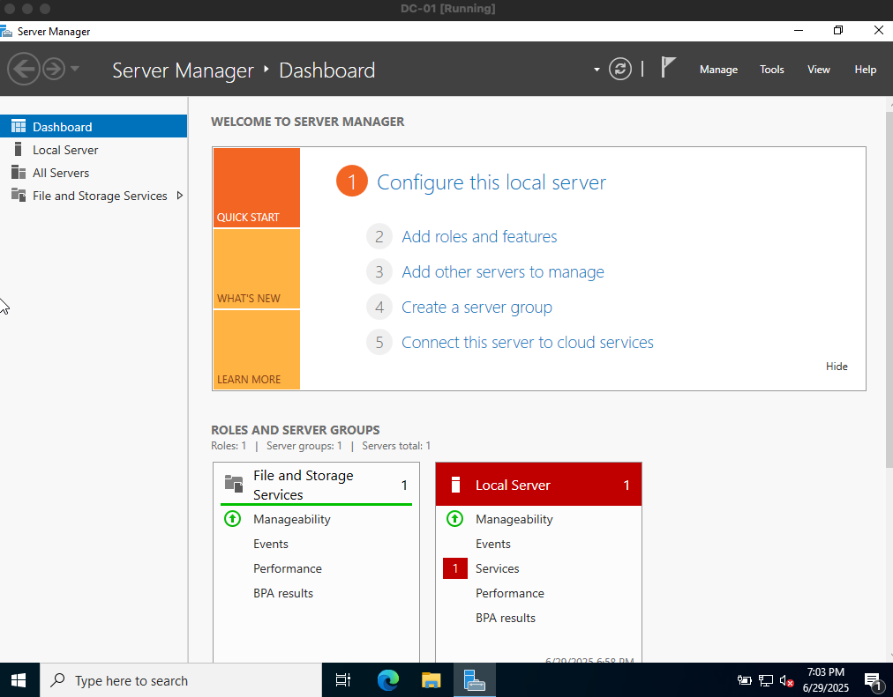
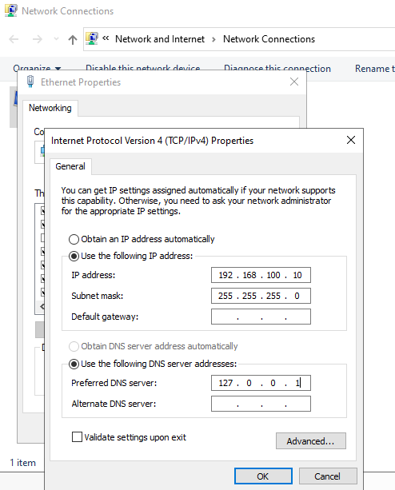
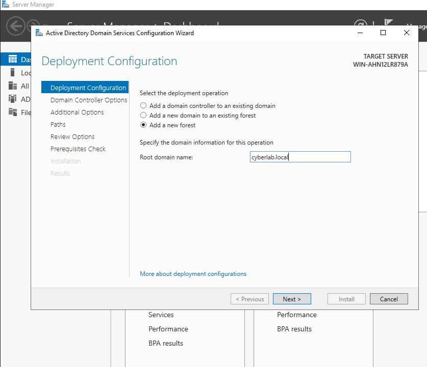
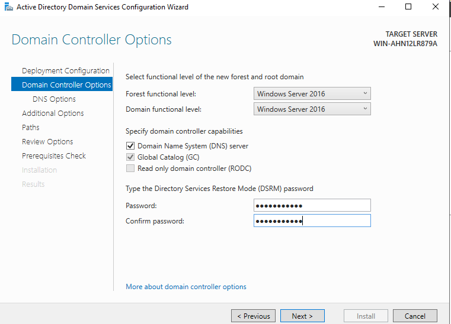
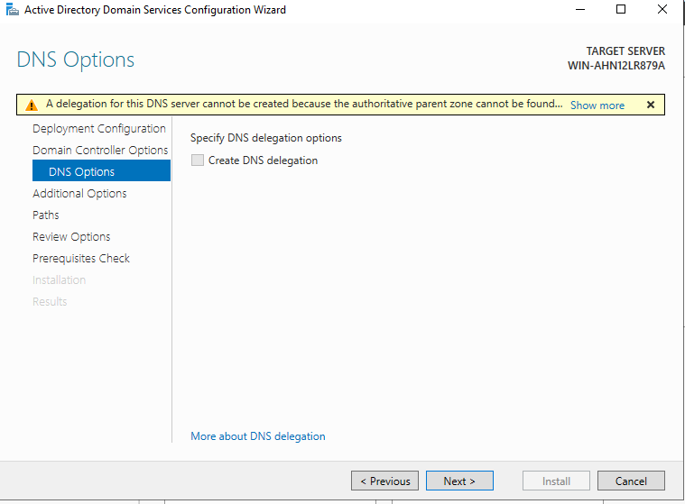
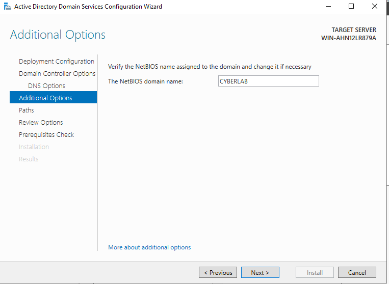
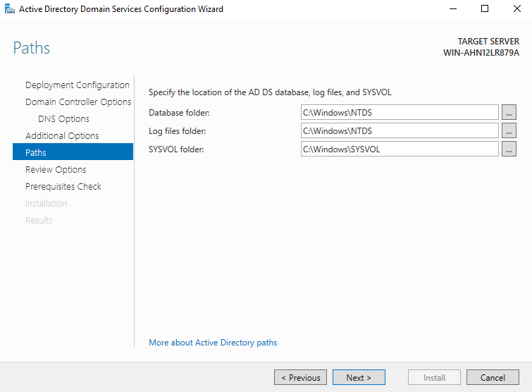
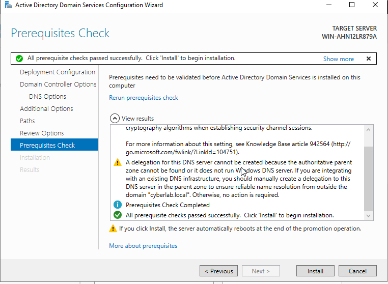
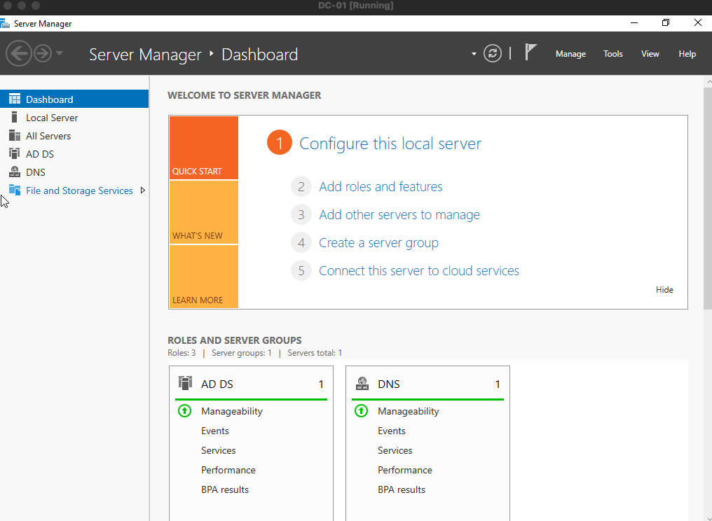
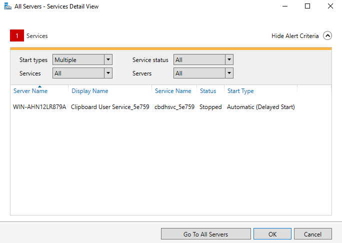

# 🧪 Lab 1: Domain Controller Setup and Promotion

**Goal:** Set up a Windows Server 2022 Standard Evaluation VM, configure a static IP, and promote it to a Domain Controller using Active Directory Domain Services (AD DS).

---

## 🧠 Why this lab matters (SOC Analyst mindset)

As a Tier 1 SOC Analyst, I'll investigate suspicious logins, privilege escalation, and authentication issues. Many of these trace back to Active Directory. This lab helps me understand how a Domain Controller is built, how it works, and why it's a high value target in many attacks.

---

## 💻 Tools Used

- Windows Server 2022 Standard Evaluation VM (named `DC-01`)
- Server Manager
- Active Directory Domain Services (AD DS)
- DNS Server
- Static IP Configuration

---

## 🔧 Key Steps

### ✅ Step 1: Launch and Configure Server Manager

- Confirmed Server Manager opened and local server was recognized.

---

### ✅ Step 2: Configure Static IP Address

- IP Address: `192.168.100.10`  
- Subnet Mask: `255.255.255.0`  
- DNS Server: `127.0.0.1`

🔍 **Why this matters:** Creating a private lab environment. This keeps the VM off the public internet. Using `127.0.0.1` as DNS means the server will refer to itself for name resolution.

---

### ✅ Step 3: Promote the Server to a Domain Controller

- Created a new forest named `cyberlab.local`

🧵 Think of a forest like a neighborhood, and the domain `cyberlab.local` is a gated community where all the trusted devices live.

---

### ✅ Step 4: Domain Controller Options

- Selected Domain Functional Level: Windows Server 2016  
- Checked DNS and Global Catalog  
- Set DSRM (Directory Services Restore Mode) password

---

### ✅ Step 5: DNS Delegation Warning

- Received a yellow warning: "A delegation for this DNS server cannot be created..."
- Did **not** check the "Create DNS delegation" box  
- ✅ This is expected for isolated lab environments

---

### ✅ Step 6: NetBIOS and Review

- NetBIOS name auto-generated: `CYBERLAB`

---

### ✅ Step 7: Final Review Before Installation

- Confirmed database, log, and SYSVOL folder locations

---

### ✅ Step 8: Prerequisite Check and Reboot

- All checks passed, install completed  
- The server rebooted automatically

---

### ✅ Step 9: Confirm AD DS and DNS Roles Installed

- Server Manager shows both AD DS and DNS with green status  
- Domain Controller is up and running

---

### ✅ Step 10: Investigate Red Warning (Non-Critical)

- Red alert was caused by the Clipboard User Service being stopped  
- ✅ This has no impact on AD DS or DNS and is safe to ignore

---

## 🔮 Reflection Question

**Q: What types of logs or alerts might indicate suspicious behavior on a domain controller?**

**A:** I would look for failed login attempts, account lockouts, or tools accessing `ntds.dit`. If I saw logon events outside of business hours or sudden group membership changes, that could be suspicious. I'd also check for PowerShell or scheduled tasks interacting with sensitive AD files.

---

